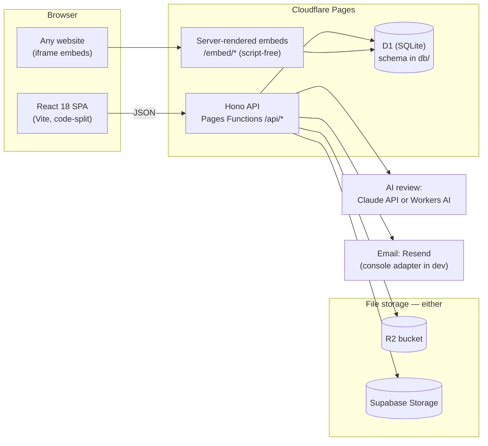

# GreenRoom

**Open-source speaker & content management for conferences** — a self-hostable alternative to Sessionboard. Run your call-for-papers, speaker onboarding, session review, and agenda building on your own Cloudflare account.

**Live demo:** https://greenroom-dev.pages.dev · [Organizer login](https://greenroom-dev.pages.dev/org/login) `admin@example.com` / `demo-greenroom-2026` · [Speaker portal](https://greenroom-dev.pages.dev/portal?token=mtok_s01_9f3a7c1e2b4d) · [Public CFP form](https://greenroom-dev.pages.dev/f/33333333-3333-4333-8333-333333333301) · [Speaker embed](https://greenroom-dev.pages.dev/embed/speakers/devconf-2026) · [Schedule embed](https://greenroom-dev.pages.dev/embed/schedule/devconf-2026)

## The 9 requirements, mapped

| # | Requirement | Where it lives |
|---|---|---|
| 1 | **CFP forms** with conditional logic + category routing | Form builder (`/org/forms`) with JSON field spec: `showIf` conditions render dynamically; category answers auto-route submissions to tracks. Public renderer at `/f/:formId`. |
| 2 | **Speaker portal** — bios, headshots, slides, documents | Magic-link portal (`/portal?token=…`): profile editing, file uploads, task checklist. No speaker passwords, ever. |
| 3 | **Communications** — templated email, reminders, calendar invites | Markdown templates with `{{name}}`-style variables, batch send with filters, full send log, per-speaker ICS feed (`/api/public/ics/:speakerId.ics`) importable into any calendar. |
| 4 | **Evaluation workflows** — scoring, rounds, AI-assisted review | Multi-round rubric scoring, reviewer queues, aggregated leaderboard, one-click AI review (Claude via `ANTHROPIC_API_KEY`, or zero-config Workers AI fallback). |
| 5 | **Scheduling** — drag-and-drop with conflict detection | dnd-kit agenda builder across rooms/tracks; server-computed conflicts (room overlap, speaker double-booking) highlighted live. |
| 6 | **Dashboard** — real-time onboarding tracking | Per-speaker task matrix with counts and overdue flags, driven by portal activity (profile saves and uploads auto-complete tasks). |
| 7 | **Accelevents integration** — one-way sync | API-key config (write-only secret), push-button sync with result log; graceful no-op without a key. |
| 8 | **Resource pages** — wiki with HTML embed | Markdown pages with sanitized custom HTML embeds, public/private flags, public listing per event. |
| 9 | **Public embeds** — mobile-friendly gallery + schedule | Server-rendered, script-free pages under 30 KB designed for iframes, backed by CORS-open cached JSON endpoints. |

**Bonus criteria:** Cloudflare-native (Pages + Functions + D1 + Workers AI) · REST API (~40 endpoints, [CONTRACTS.md](CONTRACTS.md)) · measured performance below · Airtable one-way mirror (same integration pattern as Accelevents).

## Performance (measured on the live deployment)

- Public API endpoints: **median 68 ms** (speakers 57–65 ms, schedule 63–145 ms over repeated smoke runs)
- Embed pages: **median 64 ms, ~3.4 KB** served, zero JavaScript
- Initial SPA JS: **81.5 KB gzip** against a CI-enforced 150 KB budget; org screens lazy-load in 1–17 KB chunks
- Deployment smoke suite: **15/15** green (integration suite: 86 passing)

## Architecture



- **Monorepo, TypeScript everywhere**, single root package managed with pnpm. No ORM — raw SQL prepared statements.
- **`app/`** — Vite + React 18 SPA (React Router, dnd-kit, own design system, dark/light aware). Falls back to an in-memory demo dataset (with a visible "demo data" chip) if the API is unreachable.
- **`functions/`** — Hono on Pages Functions: one catch-all for `/api/*`, one for the server-rendered `/embed/*`.
- **`db/`** — D1 schema, migrations, idempotent demo seed.
- **Auth** — organizers: email+password cookie sessions (PBKDF2); speakers: magic-link tokens.
- **Pluggable providers** — storage (R2 → Supabase → clean `storage_not_configured`), email (Resend → console), AI review (Claude → Workers AI → "not configured"). Every optional service degrades gracefully.

## Self-host quickstart

Prerequisites: Node 22+, [pnpm](https://pnpm.io), a Cloudflare account.

```sh
git clone https://github.com/Viraj0518/greenroom
cd greenroom
pnpm install
pnpm exec wrangler login

# Create your resources
pnpm exec wrangler d1 create greenroom-db      # put the returned id in wrangler.toml
pnpm db:migrate:remote

# Deploy
pnpm exec wrangler pages project create greenroom-dev
pnpm deploy
```

Open the deployed URL, register the first account (it becomes the admin), and create your event. Optionally seed the demo dataset: `pnpm exec wrangler d1 execute greenroom-db --remote --file=db/seed.sql`.

### File storage (pick one)

- **Cloudflare R2** (preferred): enable R2 on your account, `pnpm exec wrangler r2 bucket create greenroom-files`, uncomment the `FILES` binding in `wrangler.toml`, redeploy.
- **Supabase Storage**: create a Supabase project with a `greenroom-files` bucket and set the `SUPABASE_URL` and `SUPABASE_SERVICE_KEY` secrets.

With neither, uploads return a clean `storage_not_configured` error and everything else works.

### Local development

```sh
pnpm install
pnpm db:migrate:local && pnpm exec wrangler d1 execute greenroom-db --local --file=db/seed.sql
pnpm build && pnpm dev        # SPA + API + local D1 at http://127.0.0.1:8788
pnpm dev:app                  # optional: Vite HMR at :5173, /api proxied to :8788
pnpm test                     # integration suite (boots its own stack)
pnpm smoke <url>              # deployment smoke test
```

### Configuration

| Name | Kind | Purpose |
|---|---|---|
| `APP_BASE_URL` | var | Public base URL (used in emails/links) |
| `EMAIL_FROM` | var | From-address for outbound email |
| `RESEND_API_KEY` | secret (optional) | Real email via Resend; without it, emails log to console |
| `ANTHROPIC_API_KEY` | secret (optional) | AI review via Claude; without it, Workers AI is used |
| `SUPABASE_URL` / `SUPABASE_SERVICE_KEY` | secrets (optional) | Supabase Storage (see above) |

Set secrets with `pnpm exec wrangler pages secret put <NAME> --project-name greenroom-dev`.

## Demo walkthrough

1. **Organizer** — [log in](https://greenroom-dev.pages.dev/org/login) (`admin@example.com` / `demo-greenroom-2026`): dashboard with onboarding matrix, submission triage, review rounds + leaderboard, drag-and-drop schedule (try dragging a talk onto an occupied slot — conflicts highlight), comms templates + send log, resources wiki, form builder.
2. **Speaker** — open the [portal](https://greenroom-dev.pages.dev/portal?token=mtok_s01_9f3a7c1e2b4d) as the keynote speaker: edit profile, upload files, watch tasks complete.
3. **Submitter** — file a talk through the [public CFP form](https://greenroom-dev.pages.dev/f/33333333-3333-4333-8333-333333333301) (conditional fields react as you pick a category).
4. **Any website** — the [speakers](https://greenroom-dev.pages.dev/embed/speakers/devconf-2026) and [schedule](https://greenroom-dev.pages.dev/embed/schedule/devconf-2026) embeds are script-free pages made for iframing; view-source to verify.

## License

[MIT](LICENSE)
